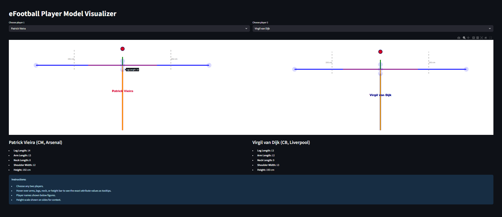

# 🎮 eFootball Player Model Visualizer

---

## 📋 Project Overview

**eFootball Player Model Visualizer** is a Python web app built with Streamlit and Plotly that allows users to visually compare hidden player model data from the popular football video game *eFootball* (formerly PES). This app displays an interactive skeleton representation of players’ body proportions—like leg length, arm length, neck length, and shoulder width—with tooltips showing exact attribute values on hover.

---
## 🎨 App Preview

## 🚀 Features

- **Interactive side-by-side comparison** of any two players.
- Visual skeletal model showing body part lengths and heights to scale.
- Mouse-hover tooltips reveal numeric values for arms, legs, neck, shoulder, and height.
- Player metadata displayed clearly (position, club).
- Clean UI with responsive layout using Streamlit.
- Easily extendable by adding player data or more attributes.
---

## ❓ Why This Project?

Understanding subtle player physical attributes — like leg length, arm span, neck length, and shoulder width — plays a crucial role in competitive football gaming, especially in realistic simulators like *eFootball* (formerly PES). These hidden model stats directly affect gameplay elements such as reach for tackles, interceptions, duels, and overall presence on the pitch, but they are not readily accessible in official menus.

This project was created to:

- **Reveal Hidden Player Metrics:** Give enthusiasts, analysts, and competitive players visual insights into these less obvious but impactful player parameters.
- **Aid Tactical Decision Making:** By comparing player models visually and numerically, users can better understand player strengths and weaknesses beyond surface-level ratings.
- **Enhance Game Analysis & Strategy:** Coaches, commentators, and fans can use this tool to appreciate the underlying physical advantages influencing player performance.
- **Demonstrate Data Visualization Techniques:** Showcase how to combine sports data with interactive visualization (Plotly and Streamlit), encouraging exploration of data-driven insights.
- **Encourage Community Engagement:** Fuel deeper discussion and research on hidden attributes in football simulation, contributing to a growing body of fan knowledge.

Ultimately, this app bridges the gap between raw data and intuitive understanding, empowering users to grasp how physical traits shape football gameplay mechanics and player effectiveness.

## ⚙️ Getting Started

### Prerequisites

- Python 3.8 or higher
- Recommended: Virtual environment (venv or conda) for package management

### Installation

1. Clone the repository:

= git clone https://github.com/BABHIJITH/efootball-playermodel-comparison.git

  = cd efootball-playermodel-comparison

2. (Optional) Create and activate a virtual environment:
= python -m venv venv

  Windows
   = venv\Scripts\activate

  Linux/Mac
   = source venv/bin/activate
---

## 🏃 Running the App Locally

Start the Streamlit development server:
streamlit run app.py
Open your browser and visit: [http://localhost:8501](http://localhost:8501)

---

## 📊 How to Use

- Select any two players from the dropdown menus.
- View the dynamic visual skeleton side-by-side.
- Hover over the body parts (arms, legs, neck, shoulders, height bar) to see detailed stats.
- Compare player physical attributes visually and statistically.

---

## 🔄 Updating Player Data or Images

- To add or update player data, modify `player_models.csv`.
- If using images, place player photos inside the `images/` directory and reference them in the CSV.
- Make sure filenames in the CSV and the images folder match exactly.

---

## 🌐 Deploying on Streamlit Community Cloud

1. Push your code to a public GitHub repository:
git init
git add .
git commit -m "Initial commit"
git branch -M main
git remote add origin https://github.com/your-username/repo-name.git
git push -u origin main
2. Go to [Streamlit Community Cloud](https://share.streamlit.io/), sign in with GitHub.

3. Click **New app**, find your repo and select the branch.

4. Set the main file as `app.py` and click **Deploy**.

---

## 📚 References & Credits

- eFootball hidden player model data sourced from community dataminers.
- Plotly Python graphing library: [https://plotly.com/python/](https://plotly.com/python/)
- Streamlit app framework: [https://streamlit.io/](https://streamlit.io/)
